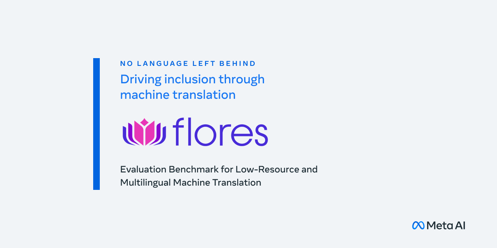

<p align="center">

</p>

--------------------------------------------------------------------------------

# The FLORES-200 Evaluation Benchmark for Low-Resource and Multilingual Machine Translation

The creation of FLORES-200 doubles the existing language coverage of FLORES-101. Given the nature of the new languages, which have less standardization and require more specialized professional translations, the verification process became more complex. This required modifications to the translation workflow. FLORES-200 has several languages which were not translated from English. Specifically, several languages were translated from Spanish, French, Russian and Modern Standard Arabic. Moreover, FLORES-200 also includes two script alternatives for four languages. 

--------------------------------------------------------------------------------

## Composition
FLORES-200 consists of translations from 842 distinct web articles, totaling
3001 sentences. These sentences are divided into three splits: dev, devtest, and test (hidden). On average, sentences are approximately 21 words long.

## Download

⚠️ This repository is no longer being updated ⚠️

**For newer versions of this dataset**, see <https://github.com/openlanguagedata/flores> and <https://www.oldi.org>.

The original version of the dataset can still be downloaded [here](https://tinyurl.com/flores200dataset) and is also available on HuggingFace [here](https://huggingface.co/datasets/facebook/flores).

## SPM and Dictionary

* Dictionary Download [here](https://tinyurl.com/nllb200dictionary)
* SPM Model Download [here](https://tinyurl.com/flores200sacrebleuspm)

### Example SentencePiece Usage
Note: Install SentencePiece from [here](https://github.com/google/sentencepiece)

```bash
flores_dataset=/path/to/flores_dataset
fairseq=/path/to/fairseq
cd $fairseq

python scripts/spm_encode.py \
    --model flores_spm_model_here \
    --output_format=piece \
    --inputs=data_input_path_here \
    --outputs=data_output_path_here
```

## Evaluation 

We primarily evaluate with chrf++:

```bash
sacrebleu -m chrf --chrf-word-order 2 {ref_file} < {hyp_file}
```

and also evaluate with spBLEU:

```bash
# tokenize with SPM
python scripts/spm_encode.py \
    --model flores_spm_model_here \
    --output_format=piece \
    --inputs={untok_hyp_file} \
    --outputs={hyp_file}

# calculate with sacrebleu
cat {hyp_file} | sacrebleu {ref_file}
```

## Languages in FLORES-200

Language | FLORES-200 code
---|---
Acehnese (Arabic script) | ace_Arab
Acehnese (Latin script) | ace_Latn
Mesopotamian Arabic | acm_Arab
Ta’izzi-Adeni Arabic | acq_Arab
Tunisian Arabic | aeb_Arab
Afrikaans | afr_Latn
South Levantine Arabic | ajp_Arab
Akan | aka_Latn
Amharic | amh_Ethi
North Levantine Arabic | apc_Arab
Modern Standard Arabic | arb_Arab
Modern Standard Arabic (Romanized) | arb_Latn
Najdi Arabic | ars_Arab
Moroccan Arabic | ary_Arab
Egyptian Arabic | arz_Arab
Assamese | asm_Beng
Asturian | ast_Latn
Awadhi | awa_Deva
Central Aymara | ayr_Latn
South Azerbaijani | azb_Arab
North Azerbaijani | azj_Latn
Bashkir | bak_Cyrl
Bambara | bam_Latn
Balinese | ban_Latn
Belarusian | bel_Cyrl
Bemba | bem_Latn
Bengali | ben_Beng
Bhojpuri | bho_Deva
Banjar (Arabic script) | bjn_Arab
Banjar (Latin script) | bjn_Latn
Standard Tibetan | bod_Tibt
Bosnian | bos_Latn
Buginese | bug_Latn
Bulgarian | bul_Cyrl
Catalan | cat_Latn
Cebuano | ceb_Latn
Czech | ces_Latn
Chokwe | cjk_Latn
Central Kurdish | ckb_Arab
Crimean Tatar | crh_Latn
Welsh | cym_Latn
Danish | dan_Latn
German | deu_Latn
Southwestern Dinka | dik_Latn
Dyula | dyu_Latn
Dzongkha | dzo_Tibt
Greek | ell_Grek
English | eng_Latn
Esperanto | epo_Latn
Estonian | est_Latn
Basque | eus_Latn
Ewe | ewe_Latn
Faroese | fao_Latn
Fijian | fij_Latn
Finnish | fin_Latn
Fon | fon_Latn
French | fra_Latn
Friulian | fur_Latn
Nigerian Fulfulde | fuv_Latn
Scottish Gaelic | gla_Latn
Irish | gle_Latn
Galician | glg_Latn
Guarani | grn_Latn
Gujarati | guj_Gujr
Haitian Creole | hat_Latn
Hausa | hau_Latn
Hebrew | heb_Hebr
Hindi | hin_Deva
Chhattisgarhi | hne_Deva
Croatian | hrv_Latn
Hungarian | hun_Latn
Armenian | hye_Armn
Igbo | ibo_Latn
Ilocano | ilo_Latn
Indonesian | ind_Latn
Icelandic | isl_Latn
Italian | ita_Latn
Javanese | jav_Latn
Japanese | jpn_Jpan
Kabyle | kab_Latn
Jingpho | kac_Latn
Kamba | kam_Latn
Kannada | kan_Knda
Kashmiri (Arabic script) | kas_Arab
Kashmiri (Devanagari script) | kas_Deva
Georgian | kat_Geor
Central Kanuri (Arabic script) | knc_Arab
Central Kanuri (Latin script) | knc_Latn
Kazakh | kaz_Cyrl
Kabiyè | kbp_Latn
Kabuverdianu | kea_Latn
Khmer | khm_Khmr
Kikuyu | kik_Latn
Kinyarwanda | kin_Latn
Kyrgyz | kir_Cyrl
Kimbundu | kmb_Latn
Northern Kurdish | kmr_Latn
Kikongo | kon_Latn
Korean | kor_Hang
Lao | lao_Laoo
Ligurian | lij_Latn
Limburgish | lim_Latn
Lingala | lin_Latn
Lithuanian | lit_Latn
Lombard | lmo_Latn
Latgalian | ltg_Latn
Luxembourgish | ltz_Latn
Luba-Kasai | lua_Latn
Ganda | lug_Latn
Luo | luo_Latn
Mizo | lus_Latn
Standard Latvian | lvs_Latn
Magahi | mag_Deva
Maithili | mai_Deva
Malayalam | mal_Mlym
Marathi | mar_Deva
Minangkabau (Arabic script) | min_Arab
Minangkabau (Latin script) | min_Latn
Macedonian | mkd_Cyrl
Plateau Malagasy | plt_Latn
Maltese | mlt_Latn
Meitei (Bengali script) | mni_Beng
Halh Mongolian | khk_Cyrl
Mossi | mos_Latn
Maori | mri_Latn
Burmese | mya_Mymr
Dutch | nld_Latn
Norwegian Nynorsk | nno_Latn
Norwegian Bokmål | nob_Latn
Nepali | npi_Deva
Northern Sotho | nso_Latn
Nuer | nus_Latn
Nyanja | nya_Latn
Occitan | oci_Latn
West Central Oromo | gaz_Latn
Odia | ory_Orya
Pangasinan | pag_Latn
Eastern Panjabi | pan_Guru
Papiamento | pap_Latn
Western Persian | pes_Arab
Polish | pol_Latn
Portuguese | por_Latn
Dari | prs_Arab
Southern Pashto | pbt_Arab
Ayacucho Quechua | quy_Latn
Romanian | ron_Latn
Rundi | run_Latn
Russian | rus_Cyrl
Sango | sag_Latn
Sanskrit | san_Deva
Santali | sat_Olck
Sicilian | scn_Latn
Shan | shn_Mymr
Sinhala | sin_Sinh
Slovak | slk_Latn
Slovenian | slv_Latn
Samoan | smo_Latn
Shona | sna_Latn
Sindhi | snd_Arab
Somali | som_Latn
Southern Sotho | sot_Latn
Spanish | spa_Latn
Tosk Albanian | als_Latn
Sardinian | srd_Latn
Serbian | srp_Cyrl
Swati | ssw_Latn
Sundanese | sun_Latn
Swedish | swe_Latn
Swahili | swh_Latn
Silesian | szl_Latn
Tamil | tam_Taml
Tatar | tat_Cyrl
Telugu | tel_Telu
Tajik | tgk_Cyrl
Tagalog | tgl_Latn
Thai | tha_Thai
Tigrinya | tir_Ethi
Tamasheq (Latin script) | taq_Latn
Tamasheq (Tifinagh script) | taq_Tfng
Tok Pisin | tpi_Latn
Tswana | tsn_Latn
Tsonga | tso_Latn
Turkmen | tuk_Latn
Tumbuka | tum_Latn
Turkish | tur_Latn
Twi | twi_Latn
Central Atlas Tamazight | tzm_Tfng
Uyghur | uig_Arab
Ukrainian | ukr_Cyrl
Umbundu | umb_Latn
Urdu | urd_Arab
Northern Uzbek | uzn_Latn
Venetian | vec_Latn
Vietnamese | vie_Latn
Waray | war_Latn
Wolof | wol_Latn
Xhosa | xho_Latn
Eastern Yiddish | ydd_Hebr
Yoruba | yor_Latn
Yue Chinese | yue_Hant
Chinese (Simplified) | zho_Hans
Chinese (Traditional) | zho_Hant
Standard Malay | zsm_Latn
Zulu | zul_Latn

## Updates to Previous Languages
Based on feedback and further Q/A, we've improved the quality of several languages:

* Quechua (quy_Latn)
* Aymara (ayr_Latn)
* Cebuano (ceb_Latn)
* Kimbundu (kmb_Latn)
* Umbundu (umb_Latn)

As a result, the results between FLORES-101 and FLORES-200 for these languages will differ slightly.

### Map between FLORES-101 Language Codes and FLORES-200 Language Codes

FLORES-200 code | FLORES-101 code
---|---
afr_Latn | afr
amh_Ethi | amh
arb_Arab | ara
asm_Beng | asm
ast_Latn | ast
azj_Latn | azj
bel_Cyrl | bel
ben_Beng | ben
bos_Latn | bos
bul_Cyrl | bul
cat_Latn | cat
ceb_Latn | ceb
ces_Latn | ces
ckb_Arab | ckb
cym_Latn | cym
dan_Latn | dan
deu_Latn | deu
ell_Grek | ell
eng_Latn | eng
est_Latn | est
fin_Latn | fin
fra_Latn | fra
fuv_Latn | ful
gle_Latn | gle
glg_Latn | glg
guj_Gujr | guj
hau_Latn | hau
heb_Hebr | heb
hin_Deva | hin
hrv_Latn | hrv
hun_Latn | hun
hye_Armn | hye
ibo_Latn | ibo
ind_Latn | ind
isl_Latn | isl
ita_Latn | ita
jav_Latn | jav
jpn_Jpan | jpn
kam_Latn | kam
kan_Knda | kan
kat_Geor | kat
kaz_Cyrl | kaz
khm_Khmr | khm
kir_Cyrl | kir
kor_Hang | kor
lao_Laoo | lao
lij_Latn | Latvian
lim_Latn | kea
lin_Latn | lin
lit_Latn | lit
ltz_Latn | ltz
lug_Latn | lug
luo_Latn | luo
lvs_Latn | lav
mal_Mlym | mal
mar_Deva | mar
mkd_Cyrl | mkd
mlt_Latn | mlt
khk_Cyrl | mon
mri_Latn | mri
mya_Mymr | mya
nld_Latn | nld
nob_Latn | nob
npi_Deva | npi
nso_Latn | nso
nya_Latn | nya
oci_Latn | oci
gaz_Latn | orm
ory_Orya | ory
pan_Guru | pan
pes_Arab | fas
pol_Latn | pol
por_Latn | por
pbt_Arab | pus
ron_Latn | ron
rus_Cyrl | rus
slk_Latn | slk
sna_Latn | sna
snd_Arab | snd
som_Latn | som
spa_Latn | spa
srp_Cyrl | srp
swe_Latn | swe
swh_Latn | swh
tam_Taml | tam
tel_Telu | tel
tgk_Cyrl | tgk
tgl_Latn | tgl
tha_Thai | tha
tur_Latn | tur
ukr_Cyrl | ukr
umb_Latn | umb
urd_Arab | urd
uzn_Latn | uzb
vie_Latn | vie
wol_Latn | wol
xho_Latn | xho
yor_Latn | yor
zho_Hans | zho_simpl
zho_Hant | zho_trad
zsm_Latn | msa
zul_Latn | zul

## Previous FLORES Releases 

### FLORES-101 
`FLORES-101` is a Many-to-Many multilingual translation benchmark dataset for 101 languages. 

* **Paper:** [The FLORES-101 Evaluation Benchmark for Low-Resource and Multilingual Machine Translation](https://ai.facebook.com/research/publications/the-flores-101-evaluation-benchmark-for-low-resource-and-multilingual-machine-translation).

* Download `FLORES-101` [**dataset**](https://dl.fbaipublicfiles.com/flores101/dataset/flores101_dataset.tar.gz) and the [WMT22 supplement](https://dl.fbaipublicfiles.com/flores101/dataset/flores_wmt22_supplement.tar.gz).

* Read the [**blogpost**](https://ai.facebook.com/blog/the-flores-101-data-set-helping-build-better-translation-systems-around-the-world) and [**paper**](https://ai.facebook.com/research/publications/the-flores-101-evaluation-benchmark-for-low-resource-and-multilingual-machine-translation).

* Evaluation server: [dynabench](https://dynabench.org/flores),
  [Instructions to submit model](/shared_tasks/dynalab/README.md)

### FLORESv1 
FLORESv1 included Nepali, Sinhala, Pashto, and Khmer. 

* **Paper:** [The FLoRes Evaluation Datasets for Low-Resource Machine Translation: Nepali-English and Sinhala-English](https://arxiv.org/abs/1902.01382)

* Download `FLORESv1` [**dataset**](/previous_releases/floresv1/)

## Citation

If you use this data in your work, please cite:

```bibtex
@article{nllb2022,
  author    = {NLLB Team, Marta R. Costa-jussà, James Cross, Onur Çelebi, Maha Elbayad, Kenneth Heafield, Kevin Heffernan, Elahe Kalbassi,  Janice Lam, Daniel Licht, Jean Maillard, Anna Sun, Skyler Wang, Guillaume Wenzek, Al Youngblood, Bapi Akula, Loic Barrault, Gabriel Mejia Gonzalez, Prangthip Hansanti, John Hoffman, Semarley Jarrett, Kaushik Ram Sadagopan, Dirk Rowe, Shannon Spruit, Chau Tran, Pierre Andrews, Necip Fazil Ayan, Shruti Bhosale, Sergey Edunov, Angela Fan, Cynthia Gao, Vedanuj Goswami, Francisco Guzmán, Philipp Koehn, Alexandre Mourachko, Christophe Ropers, Safiyyah Saleem, Holger Schwenk, Jeff Wang},
  title     = {No Language Left Behind: Scaling Human-Centered Machine Translation},
  year      = {2022}
}

@inproceedings{,
  title={The FLORES-101  Evaluation Benchmark for Low-Resource and Multilingual Machine Translation},
  author={Goyal, Naman and Gao, Cynthia and Chaudhary, Vishrav and Chen, Peng-Jen and Wenzek, Guillaume and Ju, Da and Krishnan, Sanjana and Ranzato, Marc'Aurelio and Guzm\'{a}n, Francisco and Fan, Angela},
  year={2021}
}

@inproceedings{,
  title={Two New Evaluation Datasets for Low-Resource Machine Translation: Nepali-English and Sinhala-English},
  author={Guzm\'{a}n, Francisco and Chen, Peng-Jen and Ott, Myle and Pino, Juan and Lample, Guillaume and Koehn, Philipp and Chaudhary, Vishrav and Ranzato, Marc'Aurelio},
  journal={arXiv preprint arXiv:1902.01382},
  year={2019}
}
```
